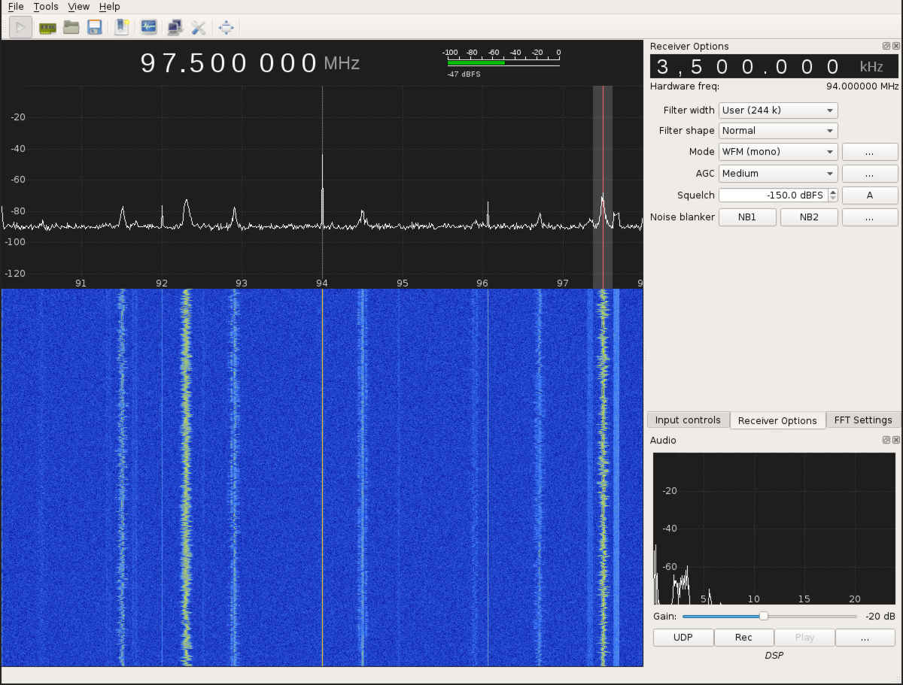

## gqrx introduction

### Goals

### Required Software
* [gqrx](/software-2016/#gqrx)

### Walkthrough

#### gqrx basics

Make sure the [rtl-sdr](rtl-sdr.com) is plugged in to a USB port, then run
`gqrx -e` (the `-e` means you want to edit settings).

This will pop up a window to select which kind of SDR you are using

1. In the Device field, choose the `Realtek SD` option for the devices we have at the conference
1. Set Input Rate to an appropriate vaule (higher will cover more of the band)
1. Click OK

Now, tune the receiver to somewhere you will be able to see the frequency you
are interested in and press the button in the top left that looks like a play
button (or a power button, depending on the version of gqrx).  To tune, scroll
the mouse wheel with the mouse cursor over the digit you want to
change on the frequency display.  The red line is where we are tuned to (for
purposes of demodulation), the light dotted line in the center of the waveform
display is the center frequency that the hackrf is tuned to.  On the right pane
in the 'Receiver Options' pane, you will see an offset from the center
frequency.

#### find an FM radio broadcast

1. make sure your antenna is an appropriate length
1. choose `WFM(mono)` for demodulation on the right
1. Tune to somewhere between 88 and 108 MHz

This is an example of the lack of radio stations available in Cache Valley.  This is from a HackRF tuned to 94.000 MHz, the receiver is tuned 3.5 MHz above that and listening to 97.5 MHz demodulated as WFM(mono).  

### Challenge

See if you can find some brodcasts that are using a different modulation.

### Additional Information

