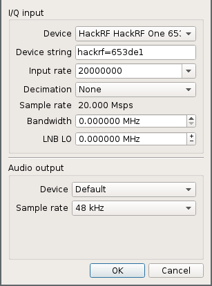
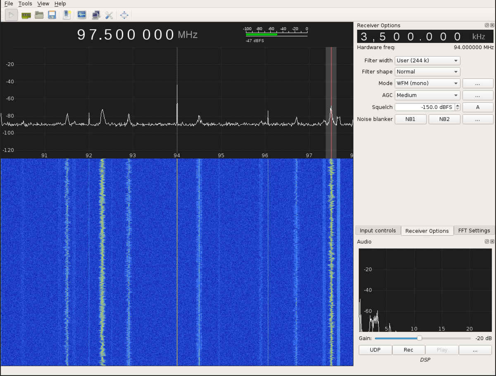

### Controlling RC Car with HackRF

#### What's the Frequency, Kenneth?

The first thing we need to know is what frequency your chosen rf car uses.
Some devices will have a label to get you close.  Another option would be to
[look up the FCC ID](https://www.fcc.gov/general/fcc-id-search-page) to find
the band it runs in.

Once you have an idea of where it runs, we need the exact frequency.  I used
[gqrx](gqrx.dk), since is relatively simple and included in debian-based
distributions.

Make sure the HackRF is plugged in to a USB port with lights on, then run `gqrx
-e` (the `-e` means you want to edit settings).

 1. In the Device field, choose the HackRF
 1. Set Input Rate to an appropriate vaule (higher will cover more of the band)
 1. Click OK

Now, tune the receiver to somewhere you will be able to see the frequency you
are interested in and press the button that looks like a 'play' button.  To
tune, scroll the mouse wheel with the mouse cursor over the digit you want to
change on the frequency display.  The red line is where we are tuned to (for
purposes of demodulation), the light dotted line in the center of the waveform
display is the center frequency that the hackrf is tuned to.  On the right pane
in the 'Receiver Options' pane, you will see an offset from the center
frequency.

This is an example of the lack of radio stations available in Cache Valley.  The HackRF is tuned to 94.000 MHz, the receiver is tuned 3.5 MHz above that and listening to 97.5 MHz demodulated as WFM(mono).  

To find your frequency, press and hold one of the controls on the remote and see if you see it appear in the waterfall display.  If you click in the waterfall display, it will tune to that frequency.  To get a better view of your current frequency, go to the FFT Settings tab on the right panel and increase the zoom.

#### How does this thing work?

Now that you know the frequency, you can get a capture of the output from your remote.  Go to Tools -> I/Q Recorder and record a sample.  From here, you could just replay the recorded sample and control your car.

Now, let's get a closer look.  Let's open the file in [inspectrum](https://github.com/miek/inspectrum).  Run `inspectrum <path/to/file.raw>`.

