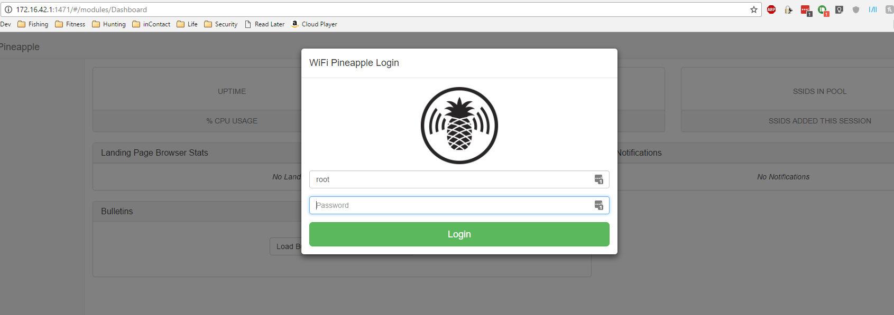
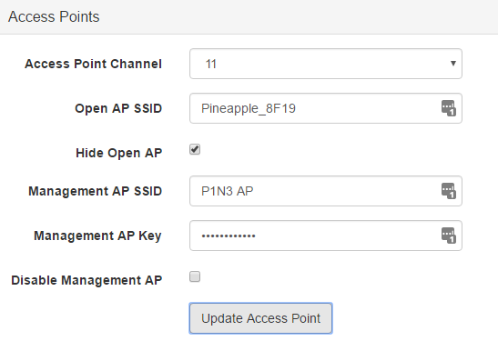
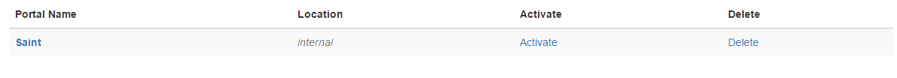
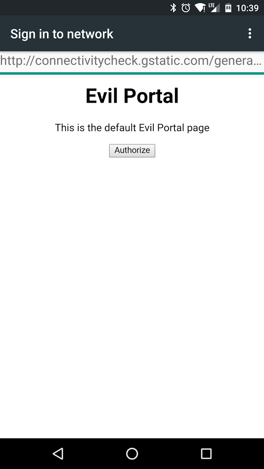
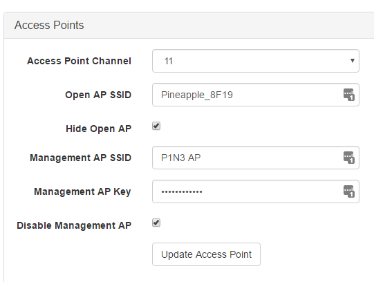

## Setting up a Rogue AP with a Captive Portal
by Nathan Smith

### Goals
In this lab we will show one of the many uses that the wifi pineapples have. This will show you how you would set up a rogue access point with a captive portal.

### Background Information
Rogue access points are defined as a “wireless **access point** that has been installed on a secure network without explicit authorization from a local network administrator, whether added by a well-meaning employee or by a malicious attacker.”

### Required Software

Evil Portal Module for wifi pineapple

### Walkthrough

Plug in the Wifi Pineapple to the raspberry pi/laptop/whatever.

Then go to <http://172.16.42.1:1471>

Once at the login screen you will use:
User: `root`
Password: `S@in7c0nR0ck$!`

Select the **Networking** option on the left hand side

Set the AP key to `3viLP0rt@l!`

Uncheck **Disable Management AP** and select Update Access Point.

Now expand the **Modules** section on the left hand side of the page.

Select **Evil Portal**.

On the workbench type in Saint then select **Create New Portal**.

You will now see Saint in the list of portals. Select **Activate**. (If you don’t see your portal, refresh the page.)

Now we will select **Live Preview**. Select the **Refresh** button.

Connect a device to your newly set up `P1N3 AP` and you can see your captive portal.

{: width="267" height="475" }

Go back to the **Networking** section.

Check the box next to **Disable Management AP** and select **Update Access Point**.

### Additional Information
Check out the [pineapple forums](https://forums.hak5.org/index.php?/forum/64-wifi-pineapple-jasager/)

Great links on Custom Captive Portals:
* [Custom NoDogSplash / Evil Portal Landing Page](https://forums.hak5.org/index.php?/topic/30730-share-my-custom-nodogsplash-evil-portal-landing-page/)

* [Creating a Simple Captive Portal for Evil Portal](https://forums.hak5.org/index.php?/topic/33576-howto-creating-a-simple-captive-portal-for-evil-portal/)

