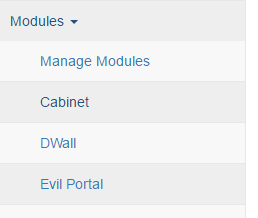

## Name for this walkthrough

### Goals

### Background Information

### Required Software
See [Package Name](/software-2016/#package-name) for installation instructions.

### Walkthrough

#### what to do first

#### what to do next

### Challenge

### Additional Information

### Delete the rest

[Useful markdown reference](https://github.com/adam-p/markdown-here/wiki/Markdown-Cheatsheet) (github-flavor, mkdocs can have subtle differences)

Some examples to see how they actually render in this environment:

list (note the blank line before the first item and the multiple of 4-spaces for indentation, mkdocs can be picky):

* bullet 1
* bullet 2
    * nested bullet item 1
        * etc
    * etc

1. bullet 3 with mkdocs ?, numbered 1 with github
    2. subitem 1

Note that github is more forgiving, the following doesn't work with mkdocs:
 1. item a
 1. item b
 1. item c
    1. item 1
    2. item 2
    1. item 3

images/links:



[link text](https://site.example/link/target)

[https://site.example/link/target] -- not sure if this does anything

(https://site.example/link/target) -- or this

<https://site.example/link/target> -- or this

Commands, etc:

you can do them inline, for example `cat /proc/cpuinfo`

you can do blocks:

```python
#!/usr/bin/env python

def main():
    print "Hello world!"

if __name__ == '__main__':
    main()
```


